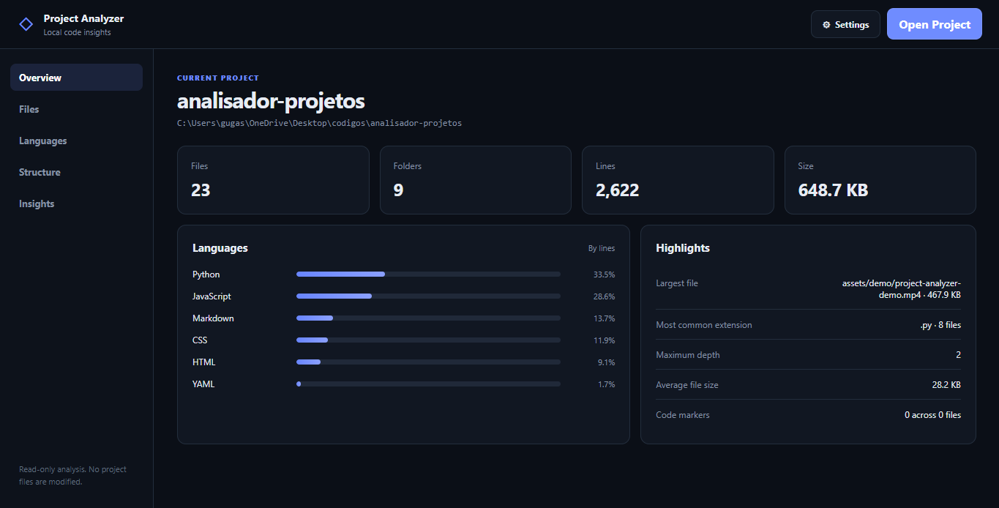
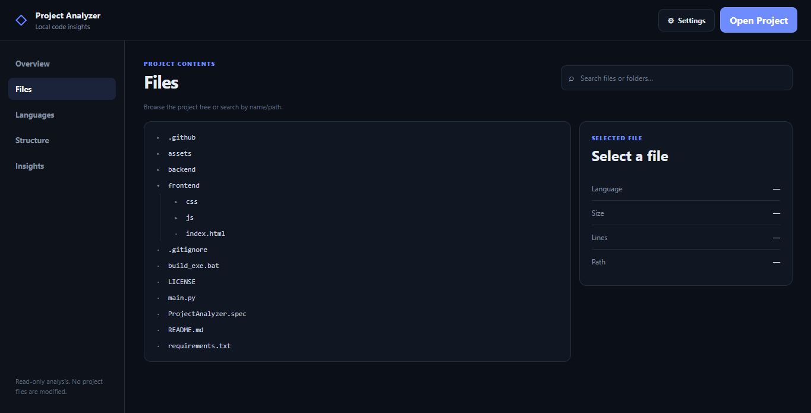
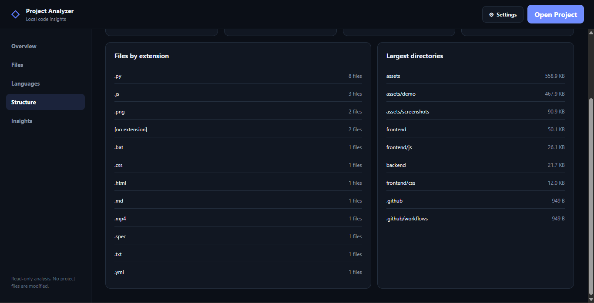

<p align="center">
  
</p>

# Project Analyzer


[Windows installer](https://github.com/ink-creator/Analisador-de-projetos/releases) · [Demo video](assets/demo/project-analyzer-demo.mp4) · [Português](README.pt-BR.md)

Analyze local programming projects through a desktop dashboard with file statistics, language distribution, project structure, code markers, and useful insights — without modifying the original files.



## Demo

[](assets/demo/project-analyzer-demo.mp4)

[Watch or download the demo video](assets/demo/project-analyzer-demo.mp4)

## Features

- Select and analyze local programming projects from a native desktop interface.
- Count files, folders, lines, total size, and average file size.
- Detect programming languages and compare their distribution by lines.
- Browse the project through an interactive file tree.
- Search for files and folders by name or path.
- Inspect file information such as language, size, line count, and path.
- Detect the largest files and directories.
- Measure project depth and find empty directories.
- Detect code markers such as `TODO`, `FIXME`, and `HACK`.
- Highlight large, empty, and unclassified files.
- Ignore common generated folders such as `.git`, `node_modules`, `.venv`, `dist`, and `build`.
- Run analyses from the command line and return the result as JSON.
- Analyze projects in read-only mode: source files are never modified.

### Project Overview

After selecting a folder, Project Analyzer scans the project and summarizes its most useful information in a single dashboard.

The overview shows file and folder counts, total lines, project size, language distribution, and highlights such as the largest file, most common extension, maximum directory depth, and detected code markers.


### File Explorer

Browse the analyzed project through an interactive tree and search for files or folders by name or path.

Selecting a file displays useful information such as its detected language, size, number of lines, and location inside the project.



### Structure and Statistics

Project Analyzer also summarizes the structure of the project, including file extensions and the largest directories.

These statistics make it easier to understand how a codebase is organized and where most of its files and storage are concentrated.



## Read-Only Analysis

Project Analyzer only reads the selected project.

It does not edit, rename, move, or delete project files. The frontend only displays the information generated by the Python analyzer.

## CLI Mode

The analyzer can also be used without the graphical interface.

Analyze a project:

```bash
python main.py --cli "C:\Projects\YourProject"
```

Return the complete result as JSON:

```bash
python main.py --cli "C:\Projects\YourProject" --json
```

The CLI analyzer uses only the Python standard library.

## Running Locally

Clone the repository:

```bash
git clone https://github.com/ink-creator/Analisador-de-projetos.git
cd Analisador-de-projetos
```

Create a virtual environment:

```bash
python -m venv .venv
```

### Windows PowerShell

```powershell
.\.venv\Scripts\Activate.ps1
pip install -r requirements.txt
python main.py
```

### Linux / macOS

```bash
source .venv/bin/activate
pip install -r requirements.txt
python main.py
```

The application opens in a native desktop window through `pywebview`.

## Tests

Run the automated tests with:

```bash
python -m unittest discover -s tests -v
```

## How It Works

```text
Selected project folder
        ↓
     Python scanner
        ↓
 Analysis and statistics
        ↓
 JSON-serializable result
        ↓
      pywebview
        ↓
 HTML / CSS / JavaScript dashboard
```

## Technologies

Python, pywebview, HTML, CSS, and JavaScript, using Python's standard library for the core analysis and `unittest` for automated tests.

<details>
<summary>Project Structure</summary>

```text
Analisador-de-projetos/
├── assets/
│   ├── demo/
│   │   └── project-analyzer-demo.mp4
│   └── screenshots/
│       ├── logo.png
│       ├── overview.png
│       ├── files.png
│       └── insights.png
├── backend/
│   ├── __init__.py
│   ├── analyzer.py
│   ├── scanner.py
│   ├── languages.py
│   ├── statistics.py
│   ├── content.py
│   └── config.py
├── frontend/
│   ├── index.html
│   ├── css/
│   │   └── style.css
│   ├── js/
│   │   ├── app.js
│   │   └── charts.js
│   └── assets/
├── tests/
│   └── test_analyzer.py
├── build_exe.bat
├── ProjectAnalyzer.spec
├── main.py
├── requirements.txt
├── README.md
├── README.pt-BR.md
└── LICENSE
```

</details>

## License

Distributed under the [MIT License](LICENSE).
